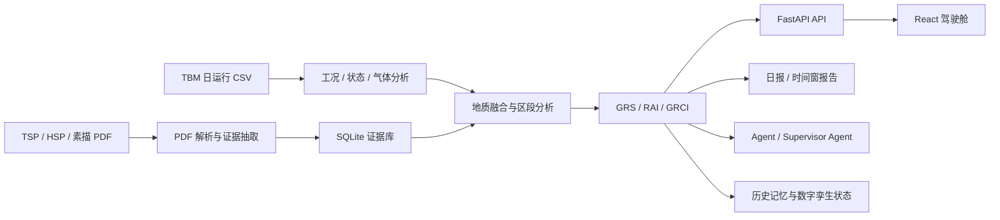

# 数字孪生和大语言模型协同驱动的 TBM 施工报告自动化生成

这是一个面向 TBM 隧道施工场景的研究型全栈系统。项目打通了 `TBM 日运行 CSV`、`TSP/HSP/洞身素描 PDF`、历史分析记录和 LLM 报告链路，目标不是让大模型直接读取原始工程数据，而是先构建轻量化数字孪生状态，再驱动大语言模型自动生成工程日报和时段分析报告。

## 文档导航

- [项目正式说明文档](docs/research_overview.md)
- [后端脚本清单](docs/backend_inventory.md)
- [证据导入说明](docs/evidence_import.md)
- [Agent 设计说明](docs/agent_v2.md)

## 项目定位

- 业务场景：TBM 隧道施工监测与地质风险研判
- 产品形态：`FastAPI + React` 全栈看板
- 目标能力：从多源数据接入到分析、解释、展示、问答的完整闭环

## 核心能力

- `TBM CSV` 工况分段、施工状态识别、气体统计、速度剖面分析
- `TSP / HSP / 素描 PDF` 解析、证据去重、里程挂接、证据库沉淀
- `GRS / RAI / GRCI` 地质风险、施工响应和耦合关系分析
- `日报 / 时间窗分析 / 会话式 Agent 问答` 三类分析入口
- `SQLite + 内存缓存` 支撑历史记录、证据库和日分析缓存
- `pytest` 回归测试覆盖核心分析、路由、解析和导入链路

## 技术栈

| 层级 | 技术 |
| --- | --- |
| 前端 | React, Vite, Recharts, Axios |
| 后端 | FastAPI, Pydantic, Pandas |
| 数据 | CSV, PDF, SQLite |
| 智能能力 | LLM 日报生成, Agent 问答 |
| 工程化 | Pytest, 懒加载, 构建拆包, `.env` 配置 |

## 架构图



## 分析流程

1. 读取指定日期的 TBM 数据，完成基础工况分段与统计。
2. 解析并导入 `TSP / HSP / 素描` 证据，按里程融合到 TBM 记录。
3. 计算 `GRS`、`RAI`、`GRCI`、前方风险提示和数字孪生状态。
4. 通过 API 输出到 React 看板、日报、时间窗分析和 Agent 问答。

## 页面概览

| 页面 | 作用 | 说明 |
| --- | --- | --- |
| `Dashboard` | 总览驾驶舱 | 日期选择、模块入口、全局状态 |
| `SummaryPage` | 工况概览 | 掘进、停机、过渡、异常统计 |
| `StatePage` | 施工状态识别 | 状态片段、效率对比、状态统计 |
| `GeologyPage` | 地质融合分析 | 区段风险、典型区段、耦合解释 |
| `GasPage` | 气体监测 | 平均值、峰值、超限关注 |
| `RiskProfilePage` | 风险剖面 | 风险证据与掘进速度对比 |
| `ReportPage` | 智能日报 | 结构化日报与 Markdown 渲染 |
| `TimeWindowPage` | 时间窗分析 | 局部时段复盘 |
| `EvidenceImportPage` | 证据导入 | PDF 预检、入库、去重反馈 |
| `AgentPage` | 智能问答 | 右侧抽屉式问答、会话记忆、专家调度轨迹 |

## 快速开始

### 1. 配置环境变量

```powershell
copy .env.example .env
```

常用变量：

```env
LLM_PROVIDER=deepseek
DEEPSEEK_API_KEY=your_key_here

DATA_ROOT=
DATA_DIR=
TSP_DIR=
HSP_DIR=
SKETCH_DIR=
APP_DB_PATH=
EVIDENCE_DB_PATH=
```

如果这些路径留空，系统会继续使用项目内置的自动路径探测逻辑。

### 2. 启动后端

```powershell
cd backend
pip install -r requirements.txt
uvicorn app:app --reload --port 8000
```

后端地址：

```text
http://127.0.0.1:8000
http://127.0.0.1:8000/docs
```

### 3. 启动前端

```powershell
cd Frontend
npm install
npm.cmd run dev
```

前端地址：

```text
http://127.0.0.1:5173
```

## 核心接口

| 方法 | 路径 | 说明 |
| --- | --- | --- |
| `GET` | `/api/tbm/dates` | 可用数据日期 |
| `GET` | `/api/tbm/summary` | 工况概览 |
| `GET` | `/api/tbm/state` | 施工状态识别 |
| `GET` | `/api/tbm/gas` | 气体统计 |
| `GET` | `/api/tbm/geology` | 地质融合与耦合分析 |
| `GET` | `/api/tbm/risk_profile` | 风险/速度剖面 |
| `GET` | `/api/tbm/digital_twin_state` | 数字孪生状态 |
| `GET` | `/api/tbm/history_memory` | 历史分析对比 |
| `POST` | `/api/tbm/report` | 智能日报生成 |
| `POST` | `/api/tbm/report_by_time` | 时间窗报告生成 |
| `POST` | `/api/tbm/agent_v2` | 会话式 Supervisor Agent 问答 |
| `GET` | `/api/tbm/agent_v2/session` | 读取问答会话历史 |
| `POST` | `/api/tbm/evidence/import` | 证据 PDF 增量导入 |

## 测试与构建

后端测试：

```powershell
cd backend
python -m pytest tests
```

前端生产构建：

```powershell
cd Frontend
npm.cmd run build
```

## 证据库工作流

首次全量建库：

```powershell
cd backend
python scripts/build_evidence_db.py
```

后续增量导入：

```powershell
cd backend
python scripts/import_evidence_reports.py "你的PDF或目录" --source-type sketch --dry-run
python scripts/import_evidence_reports.py "你的PDF或目录" --source-type sketch
```

更多说明见 [docs/evidence_import.md](docs/evidence_import.md)。

## 目录结构

```text
backend/
  analysis/                 基础分析、GRS/RAI/GRCI、耦合分析
  geology/                  地质融合、区段分析、摘要生成
  parsers/                  TSP / HSP / 素描 PDF 解析
  routes/                   FastAPI 路由
  services/                 缓存、持久化、历史、导入、数字孪生
  tests/                    后端测试

Frontend/
  src/api/                  API 封装
  src/features/             各业务页面
  vite.config.js            构建与拆包配置

docs/
  research_overview.md      项目正式说明文档
  agent_v2.md               Agent 设计说明
  evidence_import.md        证据导入说明
```

## 当前完成度

已完成：

- 统一 API 响应结构与响应 schema
- 日分析缓存与 SQLite 落库
- `.env` 配置化路径
- 路由、解析、耦合、历史、导入等后端测试
- 前端懒加载与构建拆包
- 抽屉式问答界面、会话记忆和上下文规划型 supervisor agent

下一步适合继续推进的方向：

- LLM 报告链路补更多集成测试
- Docker / 部署文档 / 健康检查
- CORS、导入接口和运行日志的进一步收口
- 模型回测、阈值敏感性和误报漏报验证
